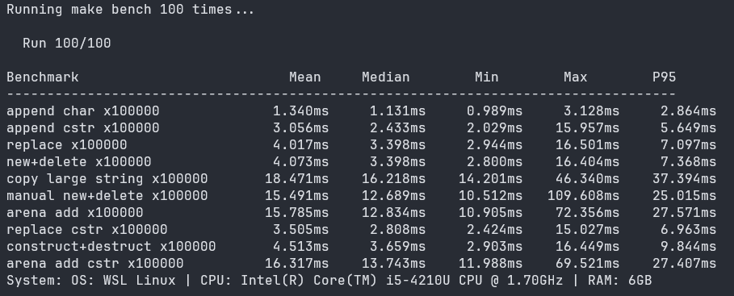

# StringQOL
A simple & minimal String QoL (Quality of Life) single header library designed to be memory safe while abstracting all the unsafe and tedious string work commonly found in C.

Contributions are welcome!

## Goals
- [X] All memory owned by the library
- [X] Memory safe
- [X] C Support and freestanding C++ support
- [X] Portable
- [X] Single header
- [X] Lightweight
- [X] Somewhat Fast

## What it isn't
- A full fletched string library with Unicode and UTF-8 support.

## Example benchmark on weak hardware

## Building
### Installing
- Just run `make install` (sudo might be needed) and you have installed StringQOL headers.

### Running tests
- Just run `make test` and you have your test results.

### Running benchmarks
- Just run `python bench.py` (No dependencies required) and you have your benchmarks.
- Read from Median to get the average result, Min to get the fastest and Max to get the slowest.

## Q&A

What is the licensing?

All files are licensed with the Unlicense License.
 

Why did you make this?

I wanted something lightweight, fast, portable and a single header library that also supported C++.
 

Will you maintain it?

Only if there's optimization to do, security fixes, bug fixes, or if I want to add another feature.
 

 